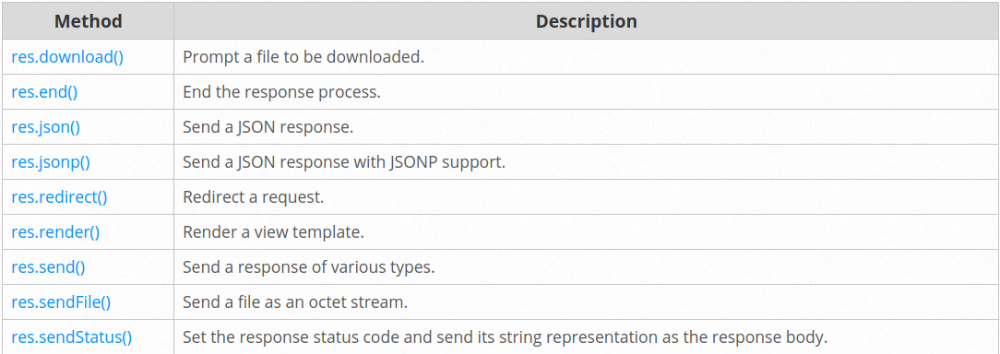

# Express Router

What exactly is the Express Router? It is a mini express application without all the bells and whistles of an express application, just the routing stuff. Let's take a look at exactly what this means. We'll go through each section of our site and use different features of the Router.

## Response methods

## review

Name 3 real world use cases where you’d want to change the request with custom middleware:

authentication ,authorization, validation

True or false: The route handler is middleware?

True

In what ways can a middleware function end the process and send data to the browser?

by calling next() so it can go the the route and send data

At what point in the request lifecycle can you “inject” middleware?

anyware before sending a request

What can cause express to error with “Request headers sent twice, cannot start a second response”?

by calling res.send in the middleware and the route handler

## Tesrms

- Middleware functions: are functions that have access to the request object (req), the response object (res), and the next function in the application’s request-response cycle. The next function is a function in the Express router which, when invoked, executes the middleware succeeding the current middleware.

- The req object represents the HTTP request and has properties for the request query string, parameters, body, HTTP headers, and so on.
- The res object represents the HTTP response that an Express app sends when it gets an HTTP request.
- Bind application-level middleware to an instance of the app object by using the app.use() and app.METHOD() functions, where METHOD is the HTTP method of the request that the middleware function handles (such as GET, PUT, or POST) in lowercase.
- Router-level middleware works in the same way as application-level middleware, except it is bound to an instance of express.Router().
